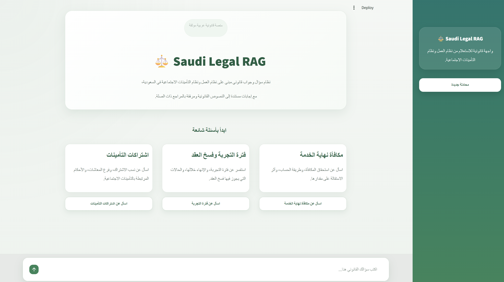
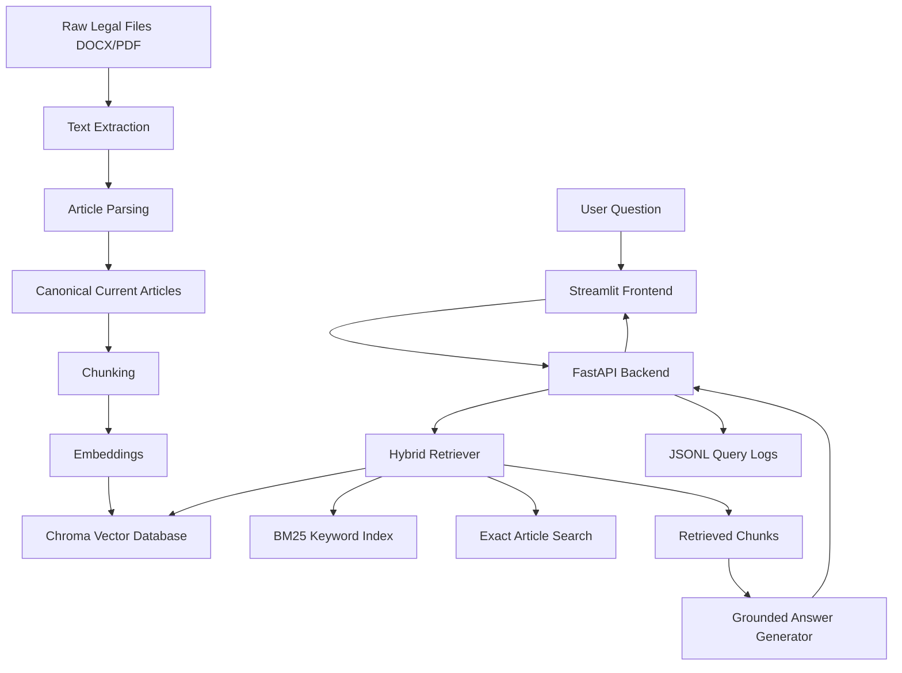

# Saudi Legal RAG System

A Retrieval-Augmented Generation (RAG) system for answering Arabic legal questions based on the Saudi Labor Law and the Social Insurance Law.

The system is designed as an Arabic-first legal assistant. It retrieves relevant legal articles, generates grounded answers, and displays citations so the user can verify the source of each answer.

---

---

## 1. Project Overview

This project implements a legal question-answering system over two Saudi legal sources:

- Saudi Labor Law
- Saudi Social Insurance Law

The system supports:

- Arabic legal question answering
- Article-level parsing
- Deterministic chunk IDs
- Semantic retrieval
- Keyword BM25 retrieval
- Hybrid Weighted RRF retrieval
- Exact article matching
- Grounded generation with citations
- Hallucination refusal
- FastAPI backend
- Streamlit frontend
- Query logging
- Retrieval evaluation

---

## 2. High-Level Architecture



---

## 3. Project Structure

```text
legal_rag_system/
├── app/
│   ├── api.py
│   ├── schemas.py
│   ├── retriever.py
│   ├── generator.py
│   ├── memory.py
│   └── logging_config.py
├── frontend/
│   ├── streamlit_app.py
│   └── assets/
│       └── style.css
├── scripts/
│   ├── extract_text.py
│   ├── inspect_text.py
│   ├── parse_articles.py
│   ├── inspect_articles.py
│   ├── resolve_current_articles.py
│   ├── chunk_documents.py
│   ├── build_index.py
│   ├── test_semantic_retriever.py
│   ├── test_keyword_retriever.py
│   ├── test_hybrid_retriever.py
│   ├── evaluate_retrieval.py
│   └── test_generation.py
├── data/
│   ├── raw/
│   ├── processed/
│   ├── chunks/
│   └── evaluation/
├── vector_db/
├── logs/
├── README.md
├── requirements.txt
├── .env.example
└── .gitignore
```

---

## 4. Arabic and English Source Handling

The project follows an Arabic-first legal design.

Arabic legal text is treated as the authoritative source for indexing, retrieval, generation, and citations. English files are used only as supporting references for structural inspection and comparison.

The final RAG index is built from the Arabic corpus only.

This choice reduces legal risk because translated legal text may differ from the official Arabic wording. For this reason, the system avoids using the English version as a source of legal truth.

Pipeline decision:

```text
English files → extraction and inspection only
Arabic files  → extraction, parsing, canonical resolution, chunking, embedding, retrieval, generation
```

---

## 5. Data Processing Pipeline

### 5.1 Text Extraction

The extraction script converts raw legal files into plain text.

Supported source formats:

- DOCX
- PDF

Output:

```text
data/processed/text/
```

### 5.2 Article Parsing

The parser detects article headings such as:

```text
المادة الأولى
المادة الثانية
المادة الثمانون
Article 1
Article 2
```

Each legal article is converted into a structured record.

### 5.3 Canonical Article Resolution

The Saudi Labor Law file contains amendments and repeated versions of some articles.

The canonical resolver groups records by:

```text
law_id + article_number
```

Then it chooses the current version and marks repealed or deleted articles as non-indexable.

### 5.4 Chunking Strategy

The system uses article-aware chunking.

Most legal articles are stored as one chunk. Long articles are split into multiple chunks using paragraph-aware splitting.

Each chunk has a deterministic ID:

```text
{law_id}__article_{article_number:03d}__chunk_{chunk_number:03d}
```

Example:

```text
labor_law__article_080__chunk_001
```

This makes evaluation reproducible and allows ground-truth test cases to refer to stable chunk IDs.

---

## 6. Vector Database and Embeddings

The project uses Chroma as the vector database.

Each chunk is embedded and stored with legal metadata such as:

- law ID
- law name
- article number
- article heading
- chunk ID
- source file

The vector database is stored under:

```text
vector_db/chroma
```

---

## 7. Retrieval Design

The system implements three retrieval methods.

### 7.1 Semantic Search

Semantic search retrieves chunks based on meaning. It is useful when the user asks naturally without using exact legal terms.

Example:

```text
متى يحق للشركة فصل الموظف؟
```

The system can retrieve articles that discuss:

```text
فسخ العقد
إنهاء العقد
تعويض
إشعار
```

### 7.2 Keyword BM25 Search

BM25 search retrieves chunks based on keyword matching.

It is useful for:

- exact legal terms
- article numbers
- legal phrases
- contribution percentages

### 7.3 Exact Article Search

The retriever detects direct article requests such as:

```text
ما حكم المادة 80؟
المادة 15 من نظام التأمينات
```

When detected, the exact article is boosted to the top of the result list.

### 7.4 Hybrid Weighted RRF

The final retriever combines:

```text
Semantic Search + BM25 + Exact Article Boost
```

using Weighted Reciprocal Rank Fusion.

This balances semantic meaning, lexical matching, and direct article lookup.

---

## 8. Retrieval Evaluation

The evaluation set is stored in:

```text
data/evaluation/test_set.json
```

It contains at least 20 legal questions with ground-truth relevant chunk IDs.

The evaluation script computes retrieval performance and stores results in:

```text
data/evaluation/retrieval_evaluation_results.json
```

Current measured Recall@10 results:

| Method | Recall@10 |
|---|---:|
| Semantic Search | 0.99 |
| Keyword BM25 | 0.79 |
| Hybrid Weighted RRF | 0.99 |

Additional metrics supported by the evaluation script:

- MRR@10
- Top-1 Accuracy
- Mean First Relevant Rank
- Perfect Queries
- Zero Recall Queries

---

## 9. Grounded Generation Policy

The answer generator is instructed to answer only from retrieved legal context.

The model must:

- answer in Arabic
- cite legal sources using labels such as `[C1]`
- avoid using external knowledge
- avoid unsupported claims
- refuse when retrieved context is insufficient

Refusal policy:

```text
لا أستطيع الإجابة من النصوص القانونية المسترجعة المتاحة.
```

This reduces hallucination risk and makes answers auditable.

---

## 10. FastAPI Backend

Run the backend:

```powershell
python -m uvicorn app.api:api --reload --port 8000
```

Main endpoints:

### Health Check

```http
GET /health
```

Returns system status, indexed chunk count, and collection name.

### Retrieval

```http
POST /retrieve
```

Returns retrieved legal chunks without generation.

### Chat

```http
POST /chat
```

Returns:

- answer
- citations
- retrieved chunks
- grounded flag
- latency
- conversation ID

---

## 11. Streamlit Frontend

Run the frontend:

```powershell
streamlit run frontend/streamlit_app.py
```

The frontend provides:

- Arabic RTL interface
- legal chat input
- suggested legal questions
- answer citations
- retrieved chunks
- answer-level evaluation in sidebar
- new conversation button

The frontend remains decoupled from the database. It communicates with the backend only through FastAPI.

---

## 12. Answer-Level Evaluation

The Streamlit sidebar can show an evaluation for each generated answer.

This lightweight evaluation estimates:

- relationship between the question and answer
- relationship between the question and cited evidence
- citation presence
- grounded answer status
- retrieved chunk coverage

This is not a replacement for the official retrieval evaluation, but it provides useful per-answer feedback during demos and manual testing.

---

## 13. Logging

The backend logs each query in JSONL format.

Log file:

```text
logs/rag_queries.jsonl
```

Each record includes:

- endpoint
- query
- retrieved chunk IDs
- citation chunk IDs
- latency
- model
- grounded flag
- answer preview

This satisfies the logging requirement and supports debugging and evaluation.

---

## 14. Innovation Evidence

The project includes a measurable retrieval improvement using Hybrid Weighted RRF and exact article boosting.

Baseline comparison:

```text
Keyword BM25 Recall@10: 0.79
Hybrid Weighted RRF Recall@10: 0.99
```

The improvement is especially useful for Arabic legal RAG because legal questions may contain a mix of:

- semantic intent
- exact article references
- legal keywords
- Arabic spelling variations

The hybrid retriever improves robustness by combining these signals.

---

## 15. Installation

Follow these steps from a clean machine.

### 15.1 Clone or Open the Project

If the project is already on your computer, open the project folder:

```powershell
cd C:\Users\M\Desktop\T2\projects\RAG\legal_rag_system
```

If you are cloning from GitHub:

```powershell
git clone <your-repository-url>
cd legal_rag_system
```

### 15.2 Create a Virtual Environment

Windows PowerShell:

```powershell
python -m venv .venv
```

Activate it:

```powershell
.\.venv\Scripts\Activate.ps1
```

If PowerShell blocks activation, run:

```powershell
Set-ExecutionPolicy -Scope Process -ExecutionPolicy Bypass
.\.venv\Scripts\Activate.ps1
```

### 15.3 Install Python Dependencies

```powershell
python -m pip install --upgrade pip
pip install -r requirements.txt
```

### 15.4 Create the `.env` File

Create a file named:

```text
.env
```

in the project root.

Use this template:

```env
OPENAI_API_KEY=your_api_key_here
OPENAI_CHAT_MODEL=gpt-5.4-mini
OPENAI_EMBEDDING_MODEL=text-embedding-3-large
CHROMA_DB_DIR=vector_db/chroma
COLLECTION_NAME=saudi_legal_rag
TOP_K_SEMANTIC=10
TOP_K_KEYWORD=10
TOP_K_FINAL=10
API_BASE_URL=http://127.0.0.1:8000
```

Do not commit `.env` to GitHub.

### 15.5 Add Raw Legal Files

Place the legal source files in the following folders:

```text
data/raw/arabic/labor_law.docx
data/raw/arabic/social_insurance_law.docx
data/raw/english/Labor_Law_EN.docx
data/raw/english/Social_Insurance_Law_EN.pdf
```

The Arabic files are used as the final legal source for the RAG index.  
The English files are used only for inspection and structural comparison.

### 15.6 Build the Data Pipeline

Run the following commands in order:

```powershell
python scripts/extract_text.py
python scripts/parse_articles.py
python scripts/inspect_articles.py
python scripts/resolve_current_articles.py
python scripts/chunk_documents.py
python scripts/build_index.py
```

After this step, the vector database should be created under:

```text
vector_db/chroma
```

### 15.7 Evaluate Retrieval

```powershell
python scripts/evaluate_retrieval.py
```

This creates:

```text
data/evaluation/retrieval_evaluation_results.json
```

### 15.8 Run the Backend API

Open a terminal in the project folder and run:

```powershell
python -m uvicorn app.api:api --reload --port 8000
```

Test the API health endpoint in your browser:

```text
http://127.0.0.1:8000/health
```

Expected response:

```json
{
  "status": "ok",
  "indexed_chunks": 304,
  "collection_name": "saudi_legal_rag"
}
```

The exact number of indexed chunks may differ if the corpus changes.

### 15.9 Run the Streamlit Frontend

Open another terminal, activate the same virtual environment, then run:

```powershell
streamlit run frontend/streamlit_app.py
```

The frontend will open in the browser.

### 15.10 Recommended Running Setup

Use two terminals:

Terminal 1:

```powershell
.\.venv\Scripts\Activate.ps1
python -m uvicorn app.api:api --reload --port 8000
```

Terminal 2:

```powershell
.\.venv\Scripts\Activate.ps1
streamlit run frontend/streamlit_app.py
```

### 15.11 Common Installation Problems

#### Problem: `ModuleNotFoundError`

Run:

```powershell
pip install -r requirements.txt
```

#### Problem: `.env` not loaded

Make sure `.env` is in the project root, not inside `app/` or `frontend/`.

#### Problem: FastAPI cannot find app

Use this command:

```powershell
python -m uvicorn app.api:api --reload --port 8000
```

#### Problem: Streamlit cannot connect to API

Make sure FastAPI is running on:

```text
http://127.0.0.1:8000
```

and make sure `.env` contains:

```env
API_BASE_URL=http://127.0.0.1:8000
```

#### Problem: Chroma index is missing

Run:

```powershell
python scripts/build_index.py
```

#### Problem: OpenAI API key error

Check that `.env` contains:

```env
OPENAI_API_KEY=your_actual_key
```

and restart both FastAPI and Streamlit.


## 16. Quick Run Commands

Install dependencies:

```powershell
pip install -r requirements.txt
```

Extract text:

```powershell
python scripts/extract_text.py
```

Parse articles:

```powershell
python scripts/parse_articles.py
```

Resolve current legal articles:

```powershell
python scripts/resolve_current_articles.py
```

Chunk documents:

```powershell
python scripts/chunk_documents.py
```

Build vector index:

```powershell
python scripts/build_index.py
```

Evaluate retrieval:

```powershell
python scripts/evaluate_retrieval.py
```

Run FastAPI:

```powershell
python -m uvicorn app.api:api --reload --port 8000
```

Run Streamlit:

```powershell
streamlit run frontend/streamlit_app.py
```

---

## 17. Limitations

- The system is not a substitute for professional legal advice.
- The English legal files are not used as final legal sources.
- The answer is limited to retrieved legal context.
- If retrieval fails to surface the right article, the generator may refuse or provide a limited answer.
- The per-answer sidebar evaluation is heuristic and intended for demo support, not formal legal validation.

---

## 18. Future Improvements

Potential improvements include:

- legal-intent-aware reranking
- cross-encoder reranking
- bilingual query support while keeping Arabic as the legal source
- improved article amendment detection
- larger evaluation dataset
- admin dashboard for logs and analytics

---

## 19. Summary

Saudi Legal RAG is an Arabic-first legal RAG system that combines structured legal preprocessing, hybrid retrieval, grounded generation, citations, evaluation, logging, FastAPI, and Streamlit.

Its main strength is that it is not a generic chatbot. It is a legal QA system designed around source grounding, reproducible chunk IDs, retrieval evaluation, and citation-based answers.
